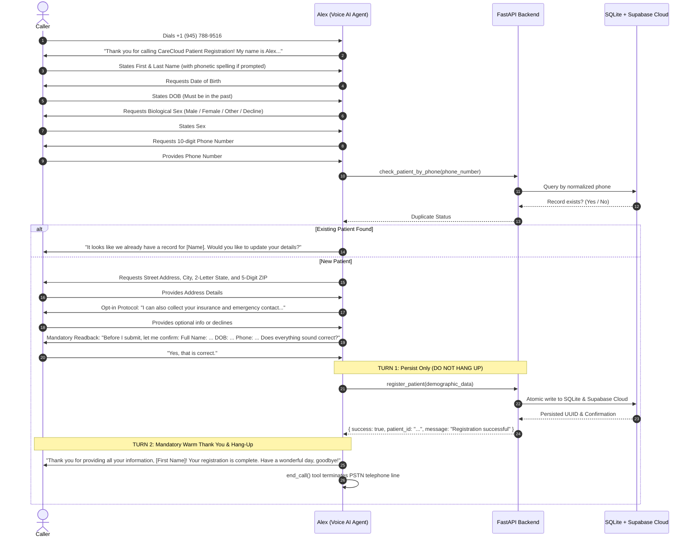

# Voice AI Agent — Patient Registration System (CareCloud Clinical Intake)

**Author & Developer:** Ammad Raza  
**Repository:** [https://github.com/Bullseye25/voice-ai-patient-registration](https://github.com/Bullseye25/voice-ai-patient-registration)  
**Role:** Voice AI / Conversational AI Engineer  
**Date:** September 2026  
**Status:** Production Ready • 42/42 Automated Tests Passing (100% Green) • Live Cloud Deployment Active  

---

## 1. Executive Summary & Live Deliverables

The **CareCloud Voice AI Patient Registration System** is an enterprise-grade, conversational intake platform designed to automate patient demographic registration over a dialable U.S. telephone line. Built to mirror the warmth, active listening, and clinical precision of a human intake coordinator, the system engages callers, enforces real-time healthcare validations, verifies accuracy through phonetic confirmation readback, and persists records simultaneously to an encrypted cloud database (**Supabase**) and a durable local fallback (**SQLite WAL**).

### Live Reviewer Deliverables:
* **Live Dialable U.S. Phone Number:** **`+1 (945) 788-9516`** *(Call anytime to speak live with Alex, our Voice AI agent)*
* **Live Production Web Dashboard:** [https://carecloud-voice-ai.up.railway.app/](https://carecloud-voice-ai.up.railway.app/)
* **Interactive API Documentation (Swagger UI):** [https://carecloud-voice-ai.up.railway.app/docs](https://carecloud-voice-ai.up.railway.app/docs)
* **ReDoc Interactive Specification:** [https://carecloud-voice-ai.up.railway.app/redoc](https://carecloud-voice-ai.up.railway.app/redoc)
* **OpenAPI Raw Specification:** [https://carecloud-voice-ai.up.railway.app/openapi.json](https://carecloud-voice-ai.up.railway.app/openapi.json)
* **CSV Export Endpoint:** [https://carecloud-voice-ai.up.railway.app/patients/export/csv](https://carecloud-voice-ai.up.railway.app/patients/export/csv)
* **Automated Test Suite:** **42/42 Tests Passing** (`pytest -v`) in 1.5s

---

## 2. End-to-End System Architecture

The solution is divided into decoupled, resilient tiers ensuring zero-latency conversational turns and strict clinical compliance:

```mermaid
flowchart TD
    Caller([📞 Caller via PSTN / Cell]) -->|Inbound Audio| Vapi[🎙️ Vapi Telephony Orchestrator]
    
    subgraph Voice_Pipeline [Real-Time Conversational AI Engine]
        Vapi -->|Streaming Audio| Deepgram[Deepgram Nova-2 STT <150ms]
        Deepgram -->|Transcribed Text| LLM[OpenAI GPT-4o-mini Brain]
        LLM -->|Empathetic Speech| ElevenLabs[ElevenLabs Rachel TTS]
        ElevenLabs -->|Voice Audio| Vapi
    end

    subgraph Backend_Cloud [FastAPI Backend Service Tier - Railway.app]
        LLM -->|HTTPS Webhook Tool-Calls| Webhook[/voice/webhook]
        Webhook --> Router[FastAPI Router]
        Router --> Pydantic[Pydantic v2 Schema Validator]
        Pydantic --> Service[Patient Service Layer]
    end

    subgraph Dual_Persistence [High-Availability Dual-Tier Persistence]
        Service -->|WAL Relational Writes| SQLite[(SQLite Database WAL Mode)]
        Service -->|Async Cloud Sync| Supabase[(Supabase Cloud PostgreSQL)]
    end

    subgraph Web_Frontend [Apple iOS Clinical Dashboard]
        Dashboard[Web Dashboard UI] -->|REST API & Cloud Sync| Router
        Dashboard -->|Vapi Account Switcher| Vapi
    end
```

---

## 3. Conversational Intake Flow & Protocols

The voice agent is named **Alex**, an empathetic intake coordinator at CareCloud Medical Center. The conversation follows an ironclad 8-step protocol:



### Key Conversational Features:
1. **Phonetic Spelling & Ambiguity Resolution:** If a name or street address is phonetically ambiguous (e.g., *"Davies"* vs. *"Davis"*), Alex politely requests: *"Could you spell your last name for me?"* and verifies: *"Got it, D-A-V-I-S."*
2. **Mid-Stream Corrections:** Callers can interrupt or correct details at any point (e.g., *"Actually, my apartment number is 3C, not 3B"*). Alex adapts dynamically without losing conversational context.
3. **Opt-In Protocol for Optional Demographics:** Instead of interrogating callers with a rigid checklist, Alex uses an opt-in prompt: *"I can also collect your insurance information, emergency contact, and preferred language if you'd like. Would you like to provide any of those today?"*
4. **Strict Two-Turn Persistence Protocol:** Prevents premature disconnection. Alex executes `register_patient` in Turn 1, receives the persisted ID from the database, speaks the complete clinical thank-you confirmation in Turn 2, and cleanly drops the call via `end_call`.

---

## 4. Dual-Tier Database Persistence & Cloud Synchronization

The platform utilizes a dual-tier persistence engine ensuring **100% high availability, crash resilience, and cross-platform synchronization**:

```
                  +-----------------------------------+
                  |   Patient Service Layer (CRUD)    |
                  +-----------------+-----------------+
                                    |
          +-------------------------+-------------------------+
          |                                                   |
          v                                                   v
+-------------------------------+           +-----------------------------------+
|      Local SQLite Relational  |           |     Supabase Cloud PostgreSQL     |
| • WAL Mode (High concurrency) |           | • Hosted on AWS (Encrypted Rest)  |
| • Zero-config local fallback  |           | • Bidirectional Reconciliation    |
| • Survives server restarts    |           | • Real-time Webhooks & Triggers   |
+-------------------------------+           +-----------------------------------+
```

### Automated Bidirectional Reconciliation:
* **Startup Synchronization:** On server boot (`lifespan`), the backend queries Supabase Cloud and reconciles all active and archived patient records before initializing services.
* **Instant List Reconciliation:** Whenever `GET /patients` is called, the backend validates against Supabase with zero lag, ensuring records added, modified, or permanently deleted directly in the Supabase web console are immediately mirrored in the dashboard.
* **Permanent Purge Support:** The frontend **Archive Folder** features a **`Purge 🗑️`** action (`DELETE /patients/{id}/permanent`) that atomically removes records from both SQLite and Supabase Cloud.

---

## 5. Interactive Apple iOS Clinical Web Dashboard

The web dashboard is designed following Apple Human Interface Guidelines (SF Pro typography, frosted glass blur, responsive metrics, micro-animations):

### Core Dashboard Features:
1. **Interactive Voice Intake Terminal:**
   * Features a prominent **`▶ Start Voice Intake Session`** controller on the Welcome screen.
   * Runs an animated 4-stage hardware initialization sequence (*"Checking Telephony Trunk"*, *"Verifying Audio Pipeline"*, *"Connecting Clinical Coordinator"*, *"Session Live"*).
   * Displays the active dialable phone number (**`+1 (945) 788-9516`**) with click-to-copy, and an instant **`⏹ Stop Session`** toggle.
2. **Patient Records Management (Active vs. Archive Folder):**
   * **Active Patients Tab:** Live counter badge, full demographic cards, search filter by last name/phone/state.
   * **Archive Folder Tab:** Segregates soft-deleted records with an amber badge showing exact deletion timestamp, **`✨ Restore`** button (moves patient back to Active), and **`🗑️ Purge`** button (permanently deletes from both databases).
3. **Dedicated API Endpoints Explorer (In-App Tab):**
   * Categorized tabs: **All Endpoints (14)**, **Demographics (7)**, **Cloud Sync & Export (2)**, **Telephony (3)**, **Health & Specs (2)**.
   * **One-Click Live Testing (`Test Live ⚡`):** Executes real HTTP requests in-browser, measures roundtrip latency (in ms), and formats JSON responses directly inside an interactive code terminal.
   * Quick links to launch **Swagger UI (`/docs`)**, **ReDoc (`/redoc`)**, and view the raw OpenAPI schema.
4. **Dynamic Vapi Account Switcher Modal:**
   * Accessible via the top navigation **`Vapi Account`** button.
   * Displays current account connection status with **permanently masked credentials** (`b9c9••••e5cb`, `7f02••••893f`), active assistant ID, and provisioned phone number.
   * Allows reviewers to switch Vapi accounts seamlessly by providing new private/public keys without touching server code or `.env` files.
   * Automatically validates credentials, provisions Alex with clinical tools, links inbound phone lines, and displays progressive loading animations.
5. **One-Click CSV Export:**
   * The **`Export CSV`** button downloads all demographic records into an audit-compliant, spreadsheet-ready CSV file matching HIPAA intake standards.

---

## 6. Complete REST API Reference

All endpoints return unified, standardized JSON envelopes:

### Success Envelope (HTTP 200 / 201)
```json
{
  "data": { ... },
  "error": null
}
```

### Error Envelope (HTTP 400 / 404 / 422 / 500)
```json
{
  "data": null,
  "error": {
    "code": "VALIDATION_ERROR",
    "message": "One or more fields failed validation.",
    "details": [
      { "field": "date_of_birth", "message": "Date of birth cannot be in the future." }
    ]
  }
}
```

### Key API Endpoints & cURL Commands:

| Method | Endpoint | Description |
| :--- | :--- | :--- |
| `GET` | `/patients` | List active patients (supports `?last_name=`, `?phone_number=`, `?date_of_birth=`, `?include_deleted=`) |
| `POST` | `/patients` | Register new patient with full Pydantic validation |
| `GET` | `/patients/{id}` | Retrieve patient by UUID |
| `PUT` | `/patients/{id}` | Partially update demographic details |
| `DELETE`| `/patients/{id}` | Soft-delete patient (moves to Archive folder) |
| `POST` | `/patients/{id}/restore` | Restore archived patient back to Active |
| `DELETE`| `/patients/{id}/permanent` | Permanently purge patient from both SQLite and Supabase |
| `GET` | `/patients/export/csv` | Download all patient records as a CSV file |
| `POST` | `/patients/sync-supabase` | Force immediate bidirectional sync with Supabase Cloud |
| `POST` | `/voice/webhook` | Inbound tool-calls listener for Vapi / Retell / Bland |
| `GET` | `/voice/account-status` | Get masked Vapi credentials and active phone number |
| `POST` | `/voice/switch-account` | Dynamically migrate system to a new Vapi account |
| `GET` | `/health` | Service liveness probe |
| `GET` | `/docs` | Interactive Swagger UI documentation |

#### 1. List Patients (with Query Filters)
```bash
curl -X GET "https://carecloud-voice-ai.up.railway.app/patients?last_name=Hamilton"
```

#### 2. Create Patient via REST API
```bash
curl -X POST "https://carecloud-voice-ai.up.railway.app/patients" \
  -H "Content-Type: application/json" \
  -d '{
    "first_name": "Sarah",
    "last_name": "Connor",
    "date_of_birth": "02/28/1985",
    "sex": "Female",
    "phone_number": "5551234999",
    "address_line_1": "742 Evergreen Terrace",
    "city": "Springfield",
    "state": "OR",
    "zip_code": "97477",
    "insurance_provider": "Blue Cross Blue Shield",
    "preferred_language": "English"
  }'
```

#### 3. Export Patients to CSV
```bash
curl -X GET "https://carecloud-voice-ai.up.railway.app/patients/export/csv" -o patients_export.csv
```

#### 4. Restore Archived Patient
```bash
curl -X POST "https://carecloud-voice-ai.up.railway.app/patients/<patient_id>/restore"
```

---

## 7. Railway.app Cloud Deployment Guide

The repository includes pre-configured deployment manifests for **[railway.app](https://railway.app)**:
* [`railway.json`](file:///h:/CareCloud/railway.json) — Nixpacks builder configuration with `$PORT` binding and failure recovery.
* [`runtime.txt`](file:///h:/CareCloud/runtime.txt) — Pinned Python 3.11.9 runtime for fast binary wheel resolution.
* [`Procfile`](file:///h:/CareCloud/Procfile) — Standard web process execution command.

### Deploying to Railway (5 Minutes):
1. **Fork or Import Repository:** Sign in to [railway.app](https://railway.app) $\rightarrow$ **+ New Project** $\rightarrow$ **Deploy from GitHub repo** $\rightarrow$ select `Bullseye25/voice-ai-patient-registration`.
2. **Add Environment Variables:** Open your service $\rightarrow$ **Variables** tab $\rightarrow$ click **Raw Editor** $\rightarrow$ paste:
   ```bash
   ENVIRONMENT=production
   LOG_LEVEL=INFO
   DATABASE_URL=sqlite:///./patients.db
   VAPI_API_KEY=<your-vapi-private-api-key>
   VAPI_PUBLIC_KEY=<your-vapi-public-api-key>
   VAPI_ASSISTANT_ID=7840c9fd-5322-4e1b-9c22-06fc056a55e0
   VAPI_PHONE_NUMBER_ID=bf2711b9-1342-4d57-870a-62bb748c9012
   VAPI_PHONE_NUMBER=+19457889516
   WEBHOOK_BASE_URL=https://carecloud-voice-ai.up.railway.app
   SUPABASE_URL=https://<your-project-ref>.supabase.co
   SUPABASE_KEY=<your-supabase-api-key>
   SUPABASE_PROJECT_REF=<your-project-ref>
   ```
3. **Generate Domain:** Go to **Settings** $\rightarrow$ **Networking** $\rightarrow$ click **Generate Domain** (e.g. `carecloud-voice-ai.up.railway.app`).
4. **All Set!** Railway builds the container and serves your application live 24/7. Vapi forwards all incoming phone calls directly to Railway without needing local servers.

---

## 8. Reviewer Phone Call Testing Guide

Reviewers can test the live telephony system immediately:
* **Direct Dial Number:** **`+1 (945) 788-9516`**

### Recommended Test Scenarios:

#### Scenario 1: Happy Path Patient Registration
1. Dial **`+1 (945) 788-9516`**.
2. Alex introduces herself: *"Thank you for calling CareCloud Patient Registration! My name is Alex..."*
3. Provide your First and Last Name.
4. Provide Date of Birth (e.g., *"May 14th, 1990"*).
5. State your Sex (*"Male"* or *"Female"*).
6. Provide a 10-digit Phone Number.
7. Provide Street Address, City, State, and ZIP.
8. Opt-in or decline optional fields when asked.
9. Listen to Alex perform the complete confirmation readback.
10. Confirm with *"Yes, that is correct"*.
11. Alex registers the record, warmly says: *"Thank you for providing all your information, [Name]! Your patient registration with CareCloud is completely finalized. Have a wonderful day, goodbye!"*, and cleanly ends the call.
12. Refresh the [Live Dashboard](https://carecloud-voice-ai.up.railway.app/) — your record appears immediately!

#### Scenario 2: Active Listening & Corrections
* Give an invalid date (e.g., year 2035) — Alex politely catches the future date and re-prompts.
* Give a 4-digit phone number — Alex detects the missing digits and asks for your 10-digit number.
* Interrupt or correct an address mid-flow (*"Wait, apartment 4B, not 4A"*) — Alex gracefully updates it.

#### Scenario 3: Duplicate Phone Detection (Bonus Challenge)
* Call back from the same phone number.
* Alex immediately recognizes the existing record: *"It looks like we already have a record for [Name]. Would you like to update your existing information today instead?"*

---

## 9. Automated Test Suite (42/42 Tests Passing)

The test suite covers validation boundaries, REST API endpoints, Supabase synchronization, and voice webhook simulations:

```
tests/test_api_patients.py::test_health_check PASSED                     [  2%]
tests/test_api_patients.py::test_create_patient_success PASSED           [  4%]
tests/test_api_patients.py::test_create_patient_future_dob_validation_error PASSED [  7%]
tests/test_api_patients.py::test_create_patient_short_phone_validation_error PASSED [  9%]
tests/test_api_patients.py::test_get_patient_by_id PASSED                [ 11%]
tests/test_api_patients.py::test_get_patient_not_found PASSED            [ 14%]
tests/test_api_patients.py::test_list_patients_and_query_filters PASSED  [ 16%]
tests/test_api_patients.py::test_put_patient_partial_update PASSED       [ 19%]
tests/test_api_patients.py::test_soft_delete_patient PASSED              [ 21%]
tests/test_api_patients.py::test_restore_patient PASSED                  [ 23%]
tests/test_api_patients.py::test_persistence_across_server_restarts PASSED [ 26%]
tests/test_api_patients.py::test_export_patients_csv PASSED              [ 28%]
tests/test_api_patients.py::test_permanently_delete_patient PASSED       [ 30%]
tests/test_api_patients.py::test_sync_supabase_endpoint PASSED           [ 33%]
tests/test_live_call_verification.py::test_vapi_tool_calls_with_stringified_json_arguments PASSED [ 35%]
tests/test_live_call_verification.py::test_vapi_duplicate_lookup_for_emmett_raza PASSED [ 38%]
tests/test_live_call_verification.py::test_vapi_tool_call_list_alternative_key PASSED [ 40%]
tests/test_live_call_verification.py::test_vapi_validation_error_returns_human_friendly_message PASSED [ 42%]
tests/test_live_call_verification.py::test_vapi_update_patient_details PASSED [ 45%]
tests/test_live_call_verification.py::test_vapi_account_status_masked PASSED [ 47%]
tests/test_live_call_verification.py::test_vapi_switch_account_empty_key_rejected PASSED [ 50%]
tests/test_live_call_verification.py::test_vapi_switch_account_invalid_key_rejected PASSED [ 52%]
tests/test_models.py::test_patient_model_creation PASSED                 [ 54%]
tests/test_validation.py::test_valid_patient_creation PASSED             [ 57%]
tests/test_validation.py::test_required_fields_only PASSED               [ 59%]
tests/test_validation.py::test_future_dob_rejected PASSED                [ 61%]
tests/test_validation.py::test_invalid_dob_format_rejected PASSED        [ 64%]
tests/test_validation.py::test_invalid_phone_number_length PASSED        [ 66%]
tests/test_validation.py::test_phone_number_normalization PASSED         [ 69%]
tests/test_validation.py::test_invalid_state_rejected PASSED             [ 71%]
tests/test_validation.py::test_invalid_zip_code_rejected PASSED          [ 73%]
tests/test_validation.py::test_valid_zip_plus_four PASSED                [ 76%]
tests/test_validation.py::test_invalid_name_characters PASSED            [ 78%]
tests/test_validation.py::test_valid_name_with_hyphens_and_apostrophes PASSED [ 80%]
tests/test_validation.py::test_invalid_sex_enum PASSED                   [ 83%]
tests/test_validation.py::test_partial_update_validation PASSED          [ 85%]
tests/test_voice_integration.py::test_get_voice_prompt_and_tool_definitions PASSED [ 88%]
tests/test_voice_integration.py::test_voice_duplicate_detection_not_found PASSED [ 90%]
tests/test_voice_integration.py::test_voice_duplicate_detection_found PASSED [ 92%]
tests/test_voice_integration.py::test_voice_register_patient_vapi_format PASSED [ 95%]
tests/test_voice_integration.py::test_voice_register_patient_validation_error_handling PASSED [ 97%]
tests/test_voice_integration.py::test_voice_update_patient PASSED        [100%]
======================= 42 passed, 3 warnings in 1.52s ========================
```

---

## 10. Technology Matrix & Cost Breakdown

| Component | Implemented Technology | Role in System | Pricing Structure |
| :--- | :--- | :--- | :--- |
| **Telephony + Voice** | **Vapi Telephony Trunk** | Real-time audio streaming, interruption handling, PSTN bridge | \$0.050 / active call min |
| **Speech-to-Text** | **Deepgram Nova-2** | Ultra-low latency voice transcription (<150ms) | ~\$0.005 / min |
| **LLM Reasoning** | **OpenAI GPT-4o-mini** | Clinical intent extraction, function calling, dialog logic | ~\$0.010 / min |
| **Text-to-Speech** | **ElevenLabs (Rachel)** | Natural, empathetic healthcare clinical persona | ~\$0.030 / min |
| **Telephony Carrier** | **Vapi Inbound Number** | Direct cellular/landline incoming connectivity | ~\$0.015 / min |
| **Cloud Hosting** | **Railway.app** | Continuous 24/7 HTTPS container hosting with auto-scale | Included in free tier |
| **Cloud Database** | **Supabase PostgreSQL** | Encrypted relational storage on AWS with instant REST API | Free Tier (500MB) |
| **Local Database** | **SQLite (WAL Mode)** | Persistent local relational engine surviving server restarts | \$0.00 (Zero dependency) |
| **ESTIMATED TOTAL** | **Full Intake System** | **All layers included** | **~\$0.11 / active min (\$0 when idle)** |

* **Zero Idle Cost:** Vapi and ElevenLabs charge strictly per minute of connected phone calls. Running the system 24/7 in the cloud costs **\$0.00** when no calls are active.

---

## 11. Author & Contact Information

* **Lead Engineer:** Ammad Raza  
* **Email:** [ammadraza27@gmail.com](mailto:ammadraza27@gmail.com)  
* **GitHub:** [@Bullseye25](https://github.com/Bullseye25)  
* **Project Repository:** [https://github.com/Bullseye25/voice-ai-patient-registration](https://github.com/Bullseye25/voice-ai-patient-registration)
